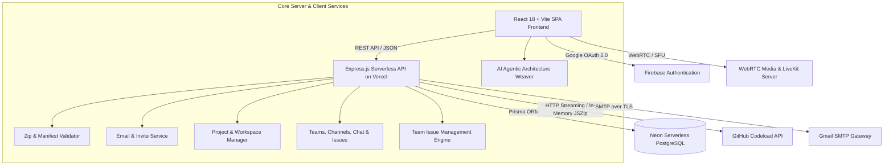

# ModuleForge — Modular Software Platform & Collaborative Engineering Ecosystem

---

## 📌 Executive Summary

**ModuleForge** is a full-stack, modular software platform and collaborative developer ecosystem designed to streamline the way developers build, publish, assemble, and collaborate on reusable software modules. 

ModuleForge bridges the gap between software registries (like npm/Docker Hub), visual architecture builders, in-browser development environments (like VS Code/Monaco), AI system orchestrators, GitHub-style issue tracking, and real-time team communication tools (like Slack/Google Meet) into a single cohesive workspace.

---

## 🚨 The Problems ModuleForge Solves

Modern software engineering and product development suffer from critical friction points:

### 1. The "Reinventing the Wheel" Problem & Code Duplication
* **Pain Point**: Engineering teams repeatedly write boilerplate code for authentication, CRM integrations, payment flows, notification engines, and UI dashboards for every new project.
* **ModuleForge Solution**: Provides a centralized, searchable **Module Marketplace** where developers can publish, discover, version, and import verified software modules with one click.

### 2. High Friction in Module Publishing & Extraction
* **Pain Point**: Distributing code traditionally requires complex packaging pipelines, npm publishing permissions, local git cloning bottlenecks, and CLI configuration overhead.
* **ModuleForge Solution**: Supports **In-Memory Streaming Ingestion** from both `.zip` archives and direct GitHub URLs (`https://github.com/owner/repo`). It automatically parses manifests (`module.json`/`package.json`), validates code integrity, and extracts file trees in memory without requiring server disk writes or CLI installations.

### 3. Tool Fragmentation & Context Switching
* **Pain Point**: Developers constantly jump between GitHub (code hosting & issues), npm (packages), Figma/Miro (architecture diagrams), VS Code (editing), Slack/Discord (chat), and Zoom/Meet (video calls).
* **ModuleForge Solution**: Consolidates the entire lifecycle into one unified interface:
  - **Explore**: Browse verified modules in the Marketplace.
  - **Build & Weave**: Assemble modules visually with the drag-and-drop Architecture Builder or ask the **AI Agentic Weaver** to auto-compose the entire stack.
  - **Track & Resolve**: Report bugs and manage feature tasks with embedded **GitHub-Style Team Issues**.
  - **Code**: Inspect and edit code directly in the browser with Monaco Editor.
  - **Collaborate**: Chat in channels, send direct messages, and jump into HD video calls with instant join links.

### 4. Poor Team Onboarding & Workspace Isolation
* **Pain Point**: Inviting teammates to private project architectures often involves manual access grants, localhost port conflicts, and broken environment links.
* **ModuleForge Solution**: Offers automated **Gmail SMTP Email Invitations** and **1-Click Secure Join Links** (`/join-project?token=...`). Teammates accept invites, authenticate securely via Google OAuth, and immediately access their team's projects without localhost redirection issues.

### 5. Lack of Real-Time Context in Development Meetings
* **Pain Point**: When teams encounter a bug or need architecture reviews, setting up external video calls disconnects discussion from the active project context.
* **ModuleForge Solution**: Features embedded **WebRTC & LiveKit HD Video Meetings**. Starting a meeting inside a team channel automatically broadcasts a live interactive meeting card with a 1-click "Join Video Call" button right inside the chat stream.

---

## 🌟 Key Features & Capabilities

```
┌────────────────────────────────────────────────────────────────────────────────────────┐
│                                      MODULEFORGE                                       │
├────────────────────┬────────────────────┬────────────────────────┬─────────────────────┤
│    MARKETPLACE     │   AI WEAVER CANVAS │   TEAM COLLABORATION   │     DEV WORKSPACE   │
│ • Module Search    │ • Prompt-to-Stack  │ • Team Workspaces      │ • Monaco VS Code    │
│ • Version Control  │ • Dynamic SVG Mesh │ • Channel & Direct Chat│ • Live Run Testing  │
│ • ZIP & Git Import │ • Auto TypeScript  │ • GitHub-Style Issues  │ • 1-Click ZIP Export│
│ • Manifest Parse   │ • 1-Click Blueprints│ • WebRTC Video Meet   │ • Deployed Previews │
└────────────────────┴────────────────────┴────────────────────────┴─────────────────────┘
```

### 1. 🤖 AI Agentic Architecture Weaver
- **Prompt-to-Architecture Synthesis**: Enter natural language descriptions (e.g. *"Build an AI SaaS with Google Auth, Stripe billing, Gemini API, and Postgres"*), and the AI Agent selects, positions, and wires matching modules automatically.
- **Dynamic SVG Neural Mesh**: Renders animated, glowing bezier curves between module ports with live protocol routing badges (`GraphQL`, `REST`, `EventStream`, `Database`).
- **Auto-Generated TypeScript Glue**: Instantly synthesizes type-safe orchestrators (`bootstrapModularMesh()`), `.env.example`, and Docker Compose multi-container configs with a 1-click inspector.
- **1-Click Curated Blueprints**: Instant architectures for *Full-Stack SaaS*, *GenAI Copilot App*, *Modern E-Commerce*, and *Enterprise CRM*.

### 2. 📋 GitHub-Style Team Issues & Ticket Tracking
- **Issues Dashboard**: Filter by status (**Open** / **Closed** counters), priority (**Urgent**, **High**, **Medium**, **Low**), and labels (`bug`, `feature`, `enhancement`, `documentation`, `security`).
- **New Issue Filing**: Report bugs and tasks with markdown descriptions, priority tags, and teammate assignment.
- **Interactive Discussion Thread**: Post comments, change assignees, update priorities, and close/reopen issues collaboratively in real-time.

### 3. 📦 Module Registry & Marketplace
- **Search & Filter**: Real-time fuzzy search by category (Auth, Payments, AI, UI, Database, CRM) and tags.
- **Dual Ingestion**: Upload custom `.zip` files or import directly from any public GitHub repository.
- **Detailed Module Inspection**: View README markdown, dependency graphs, installation scripts, and author metrics.

### 4. 🧩 Visual Architecture Builder & Canvas
- **Node-Based Canvas**: Drag and drop modules onto an interactive canvas.
- **Port Wiring & Data Flows**: Connect inputs and outputs between frontend, backend, database, and third-party APIs.
- **Live Configuration**: Configure environment variables, route endpoints, and integration props per node.

### 5. 💻 In-Browser Monaco Code Workspace
- **VS Code Engine**: Full syntax highlighting, code folding, bracket matching, and multi-file navigation directly in the browser.
- **Real-Time Testing**: Isolated environment to test module integrations before exporting to production.

### 6. 👥 Team Multi-Tenancy & Project Isolation
- **Organization & Team Management**: Create teams, assign roles (`Owner`, `Admin`, `Member`), and manage scoped projects.
- **Private Data Isolation**: Projects and uploaded modules are strictly isolated by authenticated user and team IDs.

### 7. 📹 WebRTC & LiveKit HD Video Conferencing
- **Zero-Install Video Meetings**: Built on browser WebRTC with multi-tier `getUserMedia` stream fallbacks (HD $\rightarrow$ SD $\rightarrow$ Audio/Video only).
- **Interactive In-Chat Meeting Cards**: Starting a meeting posts an instant join card into team channels.
- **Screen Sharing & Controls**: Toggle microphone, camera, screen sharing, and participant grid layout.

### 8. ✉️ Automated Invitations & Production Routing
- **Branded SMTP Mailer**: Sends automated HTML invitation emails via Gmail SMTP (`shalyagaonkar@gmail.com`).
- **Instant Join Tokens**: 1-click token validation that links new users directly to their assigned team workspace or project on `https://moduleforge-deploy-pearl.vercel.app`.

### 9. 📱 100% Mobile Responsive Interface
- **Slide-out Navigation Drawer**: Touch-friendly mobile drawer with overlay for smartphones and tablets.
- **Adaptive Layout**: Responsive search bars, touch controls, and dynamic grid layouts.

---

## 🏗️ Technical Architecture & Data Flow



---

## 🛠️ Complete Tech Stack

| Layer | Technologies Used | Purpose |
|---|---|---|
| **Frontend UI** | **React 18**, **TypeScript**, **Vite** | Lightning-fast rendering, strict type-safety, and optimized production builds |
| **Styling & Icons** | **TailwindCSS**, **Lucide React** | Modern design system, curated color tokens, responsive mobile layouts |
| **AI Orchestration**| **AI Weaver Engine**, **SVG Bezier Mesh** | Natural language architecture generation, dynamic port wiring, and TypeScript glue synthesis |
| **State Management** | **Zustand** | Lightweight, decoupled global stores (`auth`, `projects`, `teams`, `modules`, `communication`) |
| **Code Editor** | **Monaco Editor** (`@monaco-editor/react`) | In-browser VS Code editing experience |
| **Backend & API** | **Node.js**, **Express.js**, **Vercel Serverless** | Scalable REST API with modular route handlers and middleware |
| **ORM & Database** | **Prisma ORM**, **PostgreSQL (Neon DB)** | Schema modeling, relational queries, migrations, and serverless pooling |
| **Authentication** | **Firebase Authentication** | Secure Google OAuth 2.0 Sign-In and session tokens |
| **Archive Ingestion**| **JSZip**, **Multer**, **Axios** | In-memory ZIP decompresion and streaming GitHub archive extraction |
| **Real-Time Media** | **WebRTC Native APIs**, **LiveKit Client** | HD video/audio conferencing, screen sharing, active speaker detection |
| **Email Gateway** | **Nodemailer**, **Gmail SMTP** | Automated transactional emails and branded project invitation links |
| **Hosting & CI/CD** | **Vercel**, **GitHub Actions** | Automated edge deployments and production hosting |

---

## 🎯 Real-World Use Cases

1. **Enterprise Engineering Teams**: Standardize internal UI libraries, microservices, track bugs with team issues, and host video standups in one platform.
2. **Startup & Hackathon Builders**: Rapidly assemble full-stack applications by prompting the AI Weaver to connect authentication, payment, and database modules.
3. **Open-Source Maintainers**: Publish and showcase modular components with interactive live demos and automated documentation.
4. **Remote Agile Teams**: Collaborate, chat, and host architecture review video meetings in the same window where code and architecture live.

---

## 🔒 Security & Performance Highlights

- **Zero Arbitrary Execution during Ingestion**: ZIP and GitHub archives are inspected purely in memory without running untrusted scripts.
- **Serverless Edge Performance**: Stateless API functions scale dynamically with zero cold-boot bottlenecks.
- **Graceful Device Degradation**: Multi-tiered fallback ensures camera and microphone streams activate smoothly across various hardware configurations.

---

## 📄 License & Maintainer
- **Project**: ModuleForge
- **Live Application**: [https://moduleforge-deploy-pearl.vercel.app](https://moduleforge-deploy-pearl.vercel.app)
- **Repository**: [https://github.com/daneshpm/moduleforge-deploy](https://github.com/daneshpm/moduleforge-deploy)
